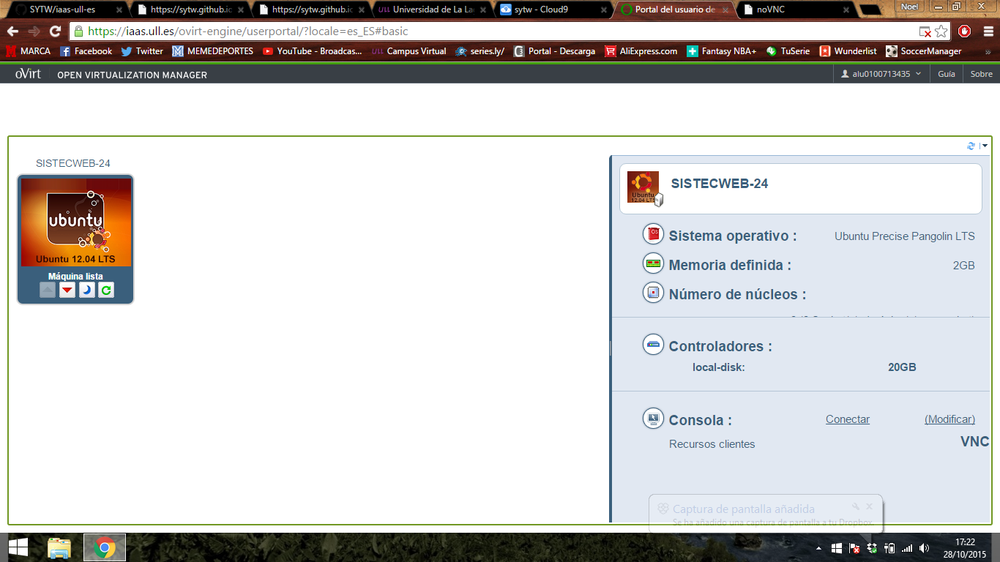
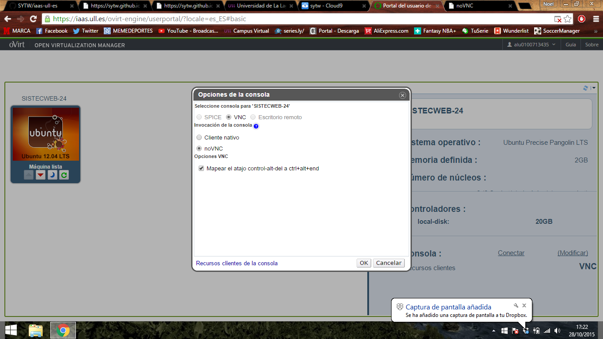
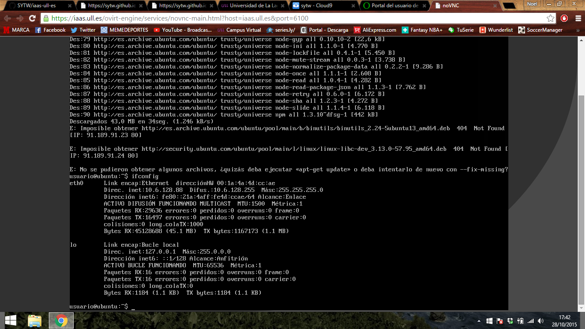
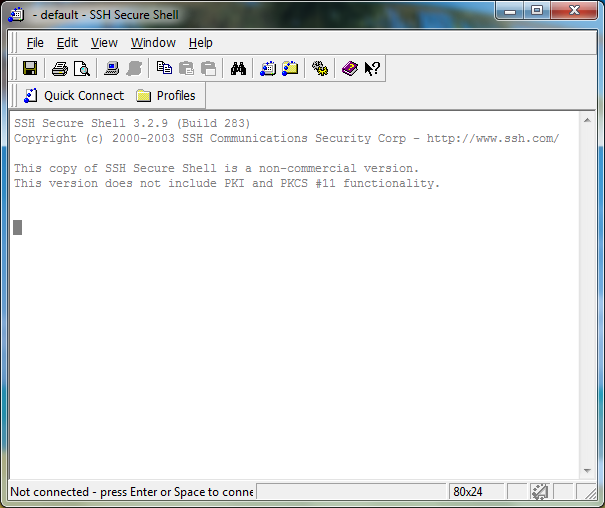

**Practica 5**
==============

Pruebas con karma, travis, mas webworker.

## Enlace al conversor ##

[Conversor en iaas](http://10.6.128.88:8080/index.html)

## Enlace a test con sinon ##
http://alu0100713435.github.io/STW_P5/test/test_sinon.html

## Enlace a mi pagina de la asignatura SYTW ##

http://alu0100713435.github.io/

## Integracion de pruebas con Travis ##

**Tutorial [iaas.ull.es](iass.ull.es)**
==============

Lo primero es entrar en la pagina de [iaas.ull.es](iass.ull.es) y logearte con tu alu y contraseña. Luego podras acceder a tu zona donde dispones de una maquina virtual en el servidor.

La arrancas y en la parte derecha de la pantalla vas a modificar, y cambias la opcion de "Cliente Nativo" a "noVNC". Luego haces doble click en la maquina y puedes usar la consola.

Lo primero que hay que hacer es introducir el usuario y la contraseña, que apra ambos casos es "usuario", y luego te pide cambiar la contraseña. Lo hacemos y asi tenemos nuestra terminal configurada. Luego hacemos 

> ifconfig

Para obtener nuestra ip que nos hara falta en el futuro.

Mas tarde hacemos 

> sudo apt-get install npm

Para poder instalar mas adelantes las dependencias de nuestra practica. 

A partir de aqui dejaremos la terminal en el navegador de lado y usaremos uno de los servicios que nos da el centro de calculo que es "SSH Secure Shell Client". 

Tenemos que obtener una clave para poder clonar nuestro repositorio de Github en el servidor, lo hacemos con el comando 

> ssh-keygen -t rsa

Una vez echo esto, clonamos nuestro repositorio en el servidor. Entramos y hacemos un npm que instale todas las dependencias. Con esto estamos listos para arrancar nuestra pagina en el servidor. Con el comando 

> nodejs static-server.js

Y listo, con esto tenemos nuestra aplicacion web corriendo en el servicio [iaas.ull.es](iass.ull.es) .

*Nota, hay que cambiar el puerto en el fichero "static-server.js" de 3000 a 80.